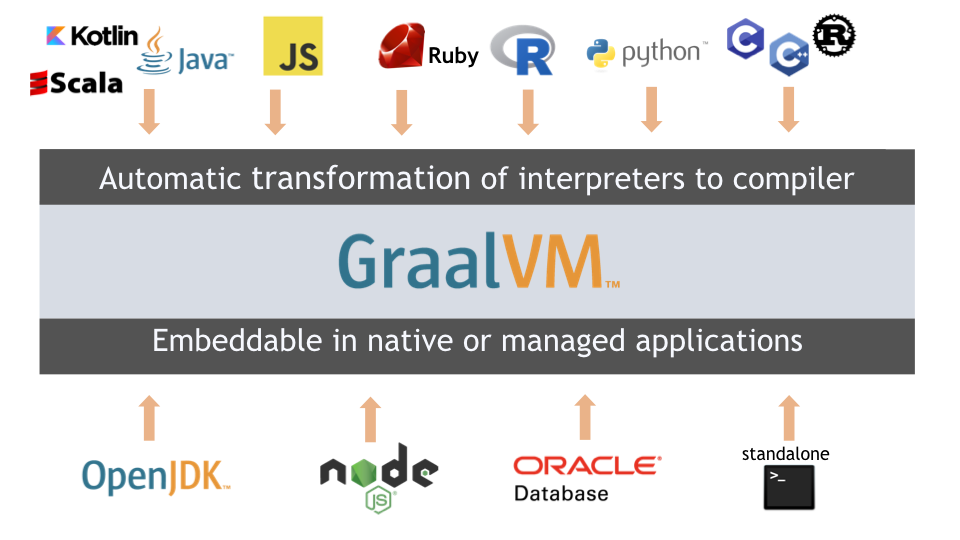

# demos for using graalvm with spring-boot

Demos for graalvm with springboot projects.

## spring with graalvm-jdk

**JDK**：[graalvm-jdk](https://www.graalvm.org/downloads/)

**dependency**: org.graalvm.sdk:graal-sdk

**support language**:

| icon                                                | language                        | requied                              | doc                                                                                     | github repo                                          |
| --------------------------------------------------- | ------------------------------- | ------------------------------------ | --------------------------------------------------------------------------------------- | ---------------------------------------------------- |
|  | python                          | gu install python                    | [Python Reference](https://www.graalvm.org/latest/reference-manual/python/)             | [graalpython](https://github.com/oracle/graalpython) |
|       | R                               | gu install R                         | [R Reference](https://)                                                                 | [fastr](https://github.com/oracle/fastr)             |
|      | js, nodejs                      | gu install js gu install nodejs | [JavaScript and Node.js Reference](https://www.graalvm.org/latest/reference-manual/js/) | [graaljs](https://github.com/oracle/graaljs)         |
|    | C/C++, Fortran, Rust and others | gu install llvm                      | [LLVM Reference](https://www.graalvm.org/latest/reference-manual/llvm/)                 |                                                      |
|    | ruby                            | gu install ruby                      | [Ruby Reference](https://www.graalvm.org/latest/reference-manual/ruby/)                 | [truffleruby](https://github.com/oracle/truffleruby) |

> ✨ 1.gu command  in “../graalvm-ce-xx/Contents/Home/bin” directory  ✨ 2. before use llvm, must compile c/c++/fortran/rus/others to executables with embedded bitcode. you can use clang/clang++ in llvm-toolchain, refer [Compiling to LLVM Bitcode
](https://www.graalvm.org/latest/reference-manual/llvm/Compiling/)

## spring with openjdk

**JDK**：[openjdk](https://openjdk.org/)

**dependency**: org.graalvm.sdk:graal-sdk, org.graalvm.js:js, org.graalvm.js:js-scriptengine

**support language**:

| icon                                            | language   | requied                                                | doc                                                                                     | github repo                                  | maven repo                                                            |
| ----------------------------------------------- | ---------- | ------------------------------------------------------ | --------------------------------------------------------------------------------------- | -------------------------------------------- | --------------------------------------------------------------------- |
|  | js, nodejs | org.graalvm.js:js  org.graalvm.js:js-scriptengine | [JavaScript and Node.js Reference](https://www.graalvm.org/latest/reference-manual/js/) | [graaljs](https://github.com/oracle/graaljs) | [maven graaljs](https://mvnrepository.com/artifact/org.graalvm.js/js) |

## graalvm docker container

**Github Container Registry**: [https://github.com/orgs/graalvm/packages](https://github.com/orgs/graalvm/packages)

**Github Repo**: [https://github.com/graalvm/container](https://github.com/graalvm/container)

| container    | install command                                    | link                                                                                                                                 |
| ------------ | -------------------------------------------------- | ------------------------------------------------------------------------------------------------------------------------------------ |
| graalvm-ce   | docker pull ghcr.io/graalvm/graalvm-ce:{VERSION}   | [https://github.com/graalvm/container/pkgs/container/graalvm-ce](https://github.com/graalvm/container/pkgs/container/graalvm-ce)     |
| jdk          | docker pull ghcr.io/graalvm/jdk:{VERSION}          | [https://github.com/graalvm/container/pkgs/container/jdk](https://github.com/graalvm/container/pkgs/container/jdk)                   |
| native-image | docker pull ghcr.io/graalvm/native-image:{VERSION} | [https://github.com/graalvm/container/pkgs/container/native-image](https://github.com/graalvm/container/pkgs/container/native-image) |
| truffleruby  | docker pull ghcr.io/graalvm/truffleruby:{VERSION}  | [https://github.com/graalvm/container/pkgs/container/truffleruby](https://github.com/graalvm/container/pkgs/container/truffleruby)   |
| nodejs       | docker pull ghcr.io/graalvm/nodejs:{VERSION}       | [https://github.com/graalvm/container/pkgs/container/nodejs](https://github.com/graalvm/container/pkgs/container/nodejs)             |
| graalpy      | docker pull ghcr.io/graalvm/graalpy:{VERSION}      | [https://github.com/graalvm/container/pkgs/container/graalpy](https://github.com/graalvm/container/pkgs/container/graalpy)           |

## Reference

[graalvm-demos repo](https://github.com/graalvm/graalvm-demos)

[graalvm examples](https://github.com/graalvm/examples)

[graalvm docs](https://www.graalvm.org/latest/docs/)

